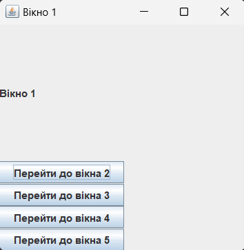

## Патерни проектування 10 (21)

**Опис**

Програма представляє собою програму, що містить 5 вікон (JFrame) 
та забезпечує можливість перемикання з одного вікна на будь яке інше.
Також у цій програмі застосовується шаблон `Singleton`

**Основні функції**

 * Можливість перемикатися між вікнами з використанням шаблону `Singleton`

**Інтерфейс користувача**

Програма використовує графічний інтерфейс на основі Swing.

**Фото**
1. Основне меню програми:

   