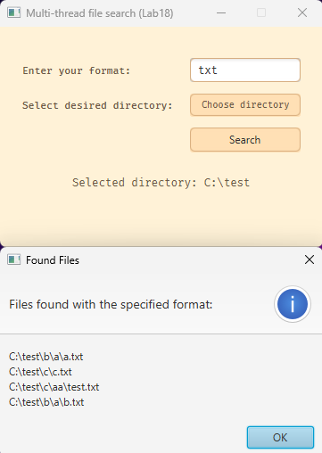

## Телефонний довідник
**Опис**

Програма представляє собою простий телефонний довідник з можливістю додавання, редагування та видалення контактів. Крім того, вона надає можливість експорту та імпорту даних з файлу.

**Основні функції**

* Додавання контакту: користувач може ввести ім'я та номер телефону нового контакту.
* Редагування контакту: користувач може змінити ім'я та/або номер телефону існуючого контакту.
* Видалення контакту: користувач може видалити існуючий контакт за його ідентифікатором.
* Перегляд усіх контактів: користувач може переглянути усі контакти з бази даних.
* Імпорт даних з файлу: користувач може імпортувати дані з текстового файлу.
* Експорт даних у файл: користувач може експортувати дані у текстовий файл.

**Інтерфейс користувача**

Програма використовує графічний інтерфейс. Користувачу виводяться доступні опції, та він може обирати необхідну опцію за допомогою введення номера опції. Після вибору опції, користувач слідує інструкціям для виконання відповідної дії.

**Примітки**

* Перед використанням програми переконайтеся, що ви налаштували підключення до бази даних MySQL (URL, ім'я користувача, пароль).
* Під час імпорту даних з файлу, впевніться, що формат даних у файлі відповідає очікуваному формату (ім'я,номер телефону через кому).
* У разі помилки під час виконання будь-якої опції, програма надасть відповідне повідомлення.

**Фото**
1. Основне меню програми:
   
2. Інтерфейс додавання контакту до бази даних
   